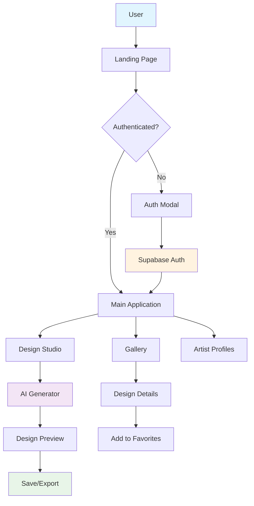
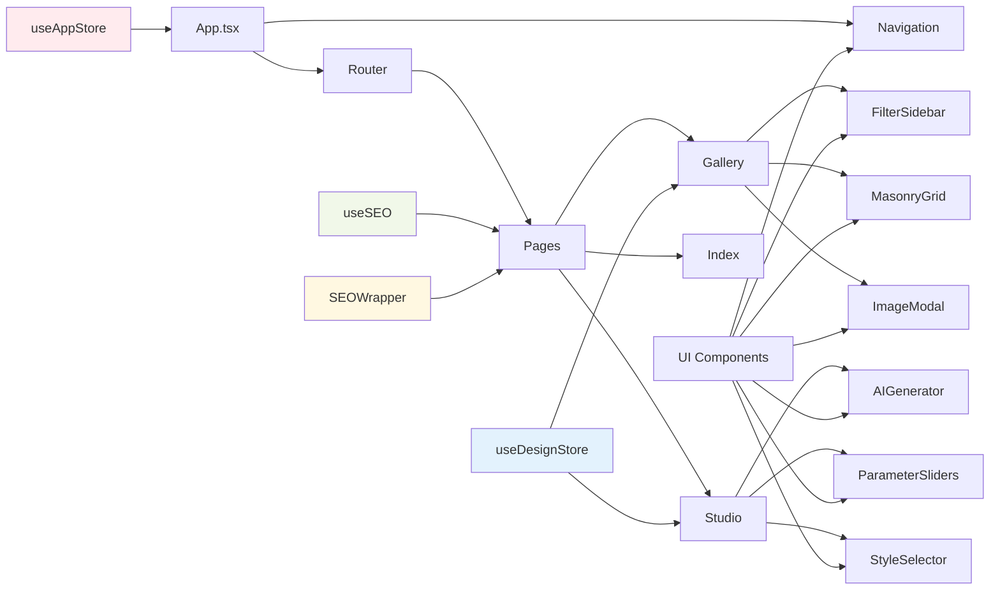
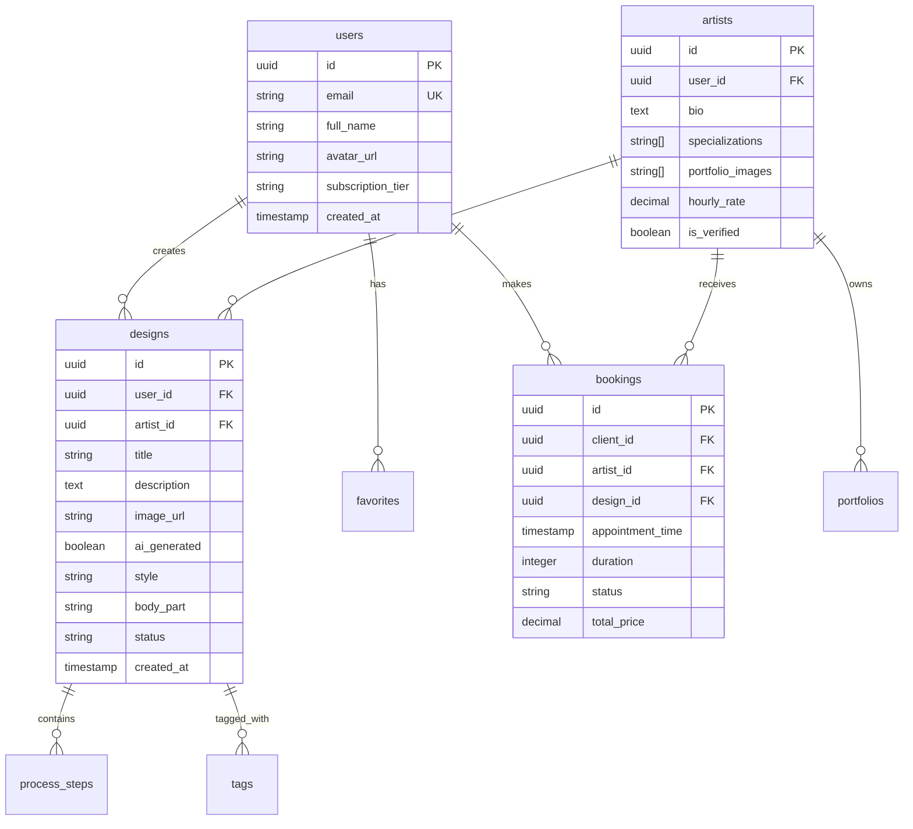
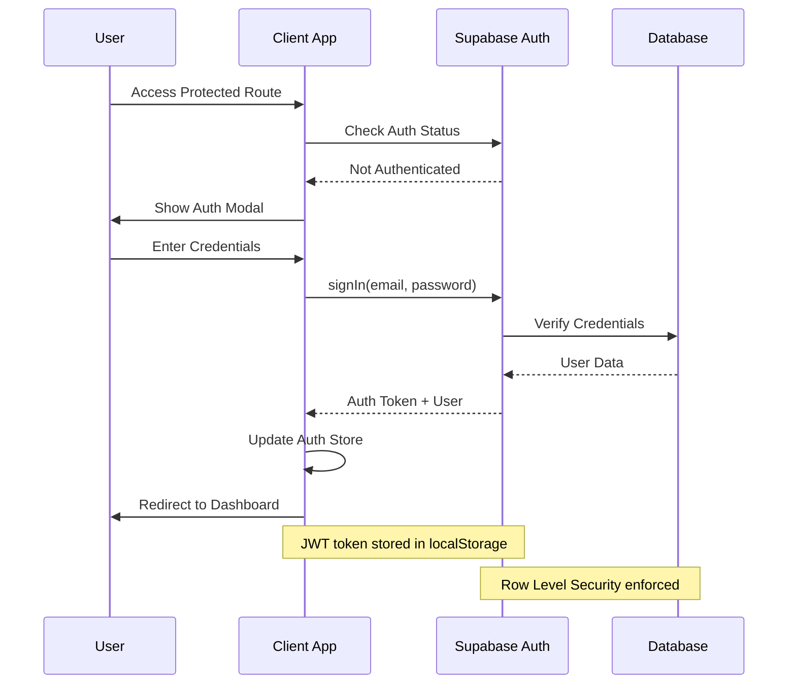
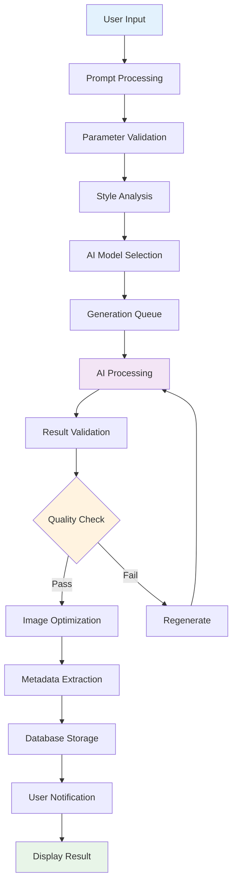

# 🏗️ InkAI Studio - System Architecture Documentation

> **Last Updated:** December 2024  
> **Version:** 1.0.0  
> **Architecture Owner:** Development Team

## Table of Contents
- [System Overview](#system-overview)
- [Architecture Diagrams](#architecture-diagrams)
- [Component Architecture](#component-architecture)
- [Data Flow](#data-flow)
- [Security Architecture](#security-architecture)
- [Integration Points](#integration-points)
- [Performance Considerations](#performance-considerations)

## System Overview

InkAI Studio is a modern, AI-powered tattoo design platform that enables users to create, customize, and explore tattoo designs through an intuitive web interface. The system follows a client-server architecture with a React frontend, Supabase backend, and integrated AI services.

### Key Architectural Principles
- **Component-Based Design** - Modular, reusable UI components
- **State Management** - Centralized state with Zustand
- **Type Safety** - Full TypeScript implementation
- **Progressive Enhancement** - SEO-friendly with client-side interactivity
- **Responsive Design** - Mobile-first approach
- **Performance Optimization** - Code splitting and lazy loading

## Architecture Diagrams

### User Interaction Flow

### Component Data Flow

### Database Entity Relationship Diagram

### Authentication Sequence

### AI Design Generation Workflow

## Component Architecture

### Core Application Structure

#### **App Component (Root)**
*Purpose:* Application entry point and global layout management
- Manages routing configuration with React Router
- Provides global context providers (Theme, Auth, Query Client)
- Handles global error boundaries and loading states
- Implements scroll restoration and route-based code splitting

#### **Navigation Component**
*Purpose:* Primary navigation interface across all pages
- Responsive navigation with mobile hamburger menu
- Authentication-aware menu items and user profile dropdown
- Scroll-based styling changes and active route highlighting
- Search functionality integration with global search state

#### **Page Components**
*Purpose:* Route-level components representing application views

**Index (Homepage)**
- Hero section with animated background and typewriter effects
- Feature showcase with interactive cards and hover animations
- Gallery preview with optimized image loading
- Testimonial carousel with auto-play functionality
- Call-to-action sections with conversion tracking

**Gallery**
- Advanced filtering system with real-time search
- Masonry grid layout with infinite scroll
- Image modal with navigation and metadata display
- SEO optimization with structured data
- Responsive design with mobile-first approach

**Studio (Design Creation)**
- AI generation interface with parameter controls
- Real-time preview with editing capabilities
- Style transfer and enhancement tools
- Export functionality with multiple formats
- Collaboration features for artist interaction

#### **State Management Architecture**

**useAppStore (Global State)**
- User authentication state and profile data
- Theme preferences and UI configuration
- Notification system and global loading states
- Navigation state and route history

**useDesignStore (Design-Specific State)**
- Design CRUD operations and caching
- AI generation progress and queue management
- Filter state and search preferences
- Favorites and user interaction tracking

### UI Component Library

#### **Base Components (shadcn/ui)**
The application uses a comprehensive set of accessible, customizable UI components:

- **Form Controls:** Input, Select, Checkbox, Radio, Switch
- **Layout:** Card, Dialog, Sheet, Accordion, Tabs
- **Feedback:** Alert, Toast, Progress, Skeleton
- **Navigation:** Button, DropdownMenu, Breadcrumb
- **Data Display:** Avatar, Badge, Table, Calendar

#### **Custom Components**
- **SEOWrapper:** Manages page-level SEO metadata and structured data
- **ParticleSystem:** Interactive background animations with mouse tracking
- **TypewriterText:** Animated text reveal with customizable timing
- **TestimonialCarousel:** Auto-playing testimonial slider with touch support

## Data Flow

### Client-Side Data Management
1. **Initial Load:** App fetches user session and core data
2. **Route Navigation:** Lazy-loaded components fetch page-specific data
3. **User Interactions:** Actions update local state and sync with backend
4. **Real-time Updates:** WebSocket connections for collaborative features
5. **Caching Strategy:** React Query manages server state with intelligent caching

### Server-Side Integration
1. **Authentication:** Supabase Auth handles user sessions and JWT tokens
2. **Database Operations:** Row Level Security enforces access control
3. **File Storage:** Supabase Storage manages design images and assets
4. **Real-time Features:** Supabase Realtime for live collaboration

## Security Architecture

### Authentication & Authorization
- **JWT-based authentication** with secure token storage
- **Row Level Security (RLS)** policies in Supabase
- **Role-based access control** for different user types
- **Session management** with automatic token refresh

### Data Protection
- **Input validation** on both client and server
- **SQL injection prevention** through parameterized queries
- **XSS protection** via Content Security Policy
- **HTTPS enforcement** for all communications

### Privacy Compliance
- **GDPR compliance** with data export/deletion
- **User consent management** for analytics and cookies
- **Data minimization** principles in data collection
- **Transparent privacy policy** and terms of service

## Integration Points

### External Services
- **Supabase:** Primary backend for authentication, database, and storage
- **AI Services:** External APIs for design generation and style transfer
- **CDN:** Image optimization and global content delivery
- **Analytics:** User behavior tracking and performance monitoring

### API Integrations
- **RESTful APIs:** Standard HTTP endpoints for CRUD operations
- **GraphQL (Future):** Planned migration for more efficient queries
- **WebSocket:** Real-time features for collaborative editing
- **Webhooks:** Event-driven integrations with external services

## Performance Considerations

### Frontend Optimization
- **Code Splitting:** Route-based and component-based splitting
- **Lazy Loading:** Images and non-critical components
- **Bundle Analysis:** Regular monitoring of bundle size
- **Caching Strategy:** Service worker for offline functionality

### Backend Optimization
- **Database Indexing:** Optimized queries for common operations
- **Connection Pooling:** Efficient database connection management
- **CDN Integration:** Global asset distribution
- **Caching Layers:** Redis for frequently accessed data

### Monitoring & Analytics
- **Performance Metrics:** Core Web Vitals tracking
- **Error Monitoring:** Comprehensive error reporting
- **User Analytics:** Behavior analysis and conversion tracking
- **Infrastructure Monitoring:** Server health and response times

---

**Version History:**
- v1.0.0 (December 2024) - Initial architecture documentation
- v0.9.0 (November 2024) - Core component design
- v0.8.0 (October 2024) - Initial system design
